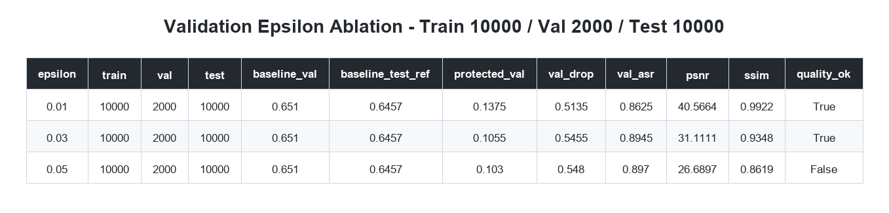
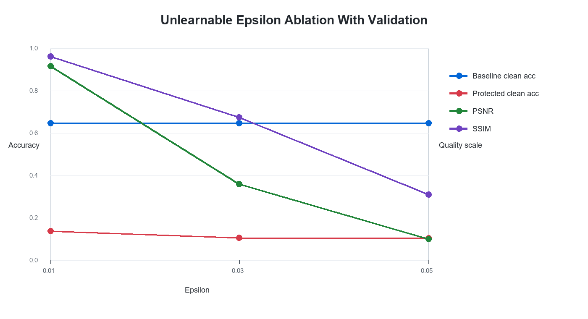
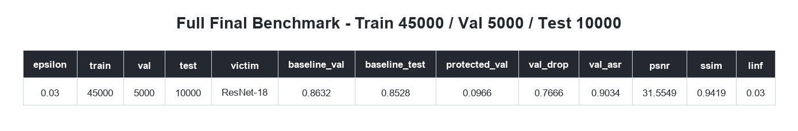
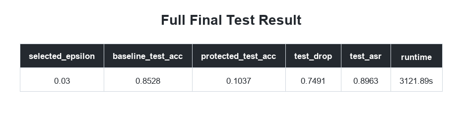
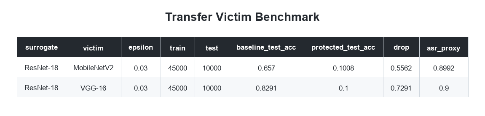
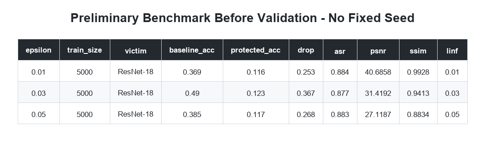
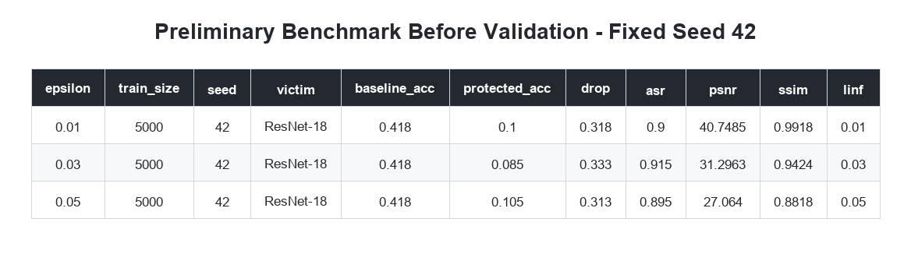

# Báo Cáo Thực Nghiệm: Unlearnable Examples

## 1. Mục Tiêu Thực Nghiệm

Thực nghiệm này đánh giá kỹ thuật **Unlearnable Examples** cho bài toán bảo vệ dữ liệu ảnh khỏi việc bị mô hình học sâu khai thác để huấn luyện.

Ý tưởng chính là tạo một bộ dữ liệu đã bảo vệ (*protected dataset*) bằng cách thêm nhiễu có ràng buộc vào ảnh gốc. Mô hình victim được huấn luyện trên bộ dữ liệu đã bảo vệ, sau đó được đánh giá trên **clean test set**. Nếu accuracy trên clean test set giảm mạnh, điều đó cho thấy mô hình đã học các shortcut do nhiễu tạo ra thay vì học đặc trưng thật của ảnh.

## 2. Thuật Ngữ Và Vai Trò Mô Hình

**Surrogate model** là mô hình được dùng trong quá trình sinh nhiễu. Trong thực nghiệm này, surrogate là ResNet-18 đã được điều chỉnh cho CIFAR-10.

**Victim model** là mô hình được huấn luyện trên protected dataset để kiểm tra hiệu quả bảo vệ. Victim có thể trùng hoặc khác kiến trúc với surrogate.

Nếu protected dataset làm nhiều victim architectures khác nhau cùng thất bại trên clean test set, ta có bằng chứng về **transferability** của nhiễu.

## 3. Dataset Và Protocol Đánh Giá

Dataset chính là **CIFAR-10**, gồm 10 lớp ảnh. Accuracy đoán ngẫu nhiên trên CIFAR-10 xấp xỉ `0.10`.

Protocol đánh giá:

1. Huấn luyện baseline victim trên clean training set.
2. Đánh giá baseline victim trên clean test set.
3. Sinh class-wise unlearnable noise bằng surrogate model.
4. Áp dụng noise lên clean training set để tạo protected dataset.
5. Huấn luyện victim model mới trên protected dataset.
6. Đánh giá victim này trên clean test set.

Điểm quan trọng là victim **không** được đánh giá trên ảnh đã thêm nhiễu. Nó được đánh giá trên clean test set để kiểm tra liệu mô hình có học được đặc trưng thật hay không.

## 4. Chọn Hyperparameter Bằng Validation

Ban đầu, các giá trị epsilon được chạy riêng lẻ trên subset nhỏ. Sau đó, protocol được cải thiện bằng validation split để chọn epsilon.

Trong validation run, cấu hình là:

- Train subset: 10000 ảnh
- Validation subset: 2000 ảnh
- Test set: 10000 ảnh
- Seed: 42
- Baseline epochs: 20
- Victim epochs: 20
- PGD steps: 10
- Inner epochs: 2

Kết quả validation cho thấy:

- `epsilon=0.01`: chất lượng ảnh rất cao, nhưng attack yếu hơn `epsilon=0.03`.
- `epsilon=0.03`: protected validation accuracy thấp, PSNR/SSIM vẫn tốt.
- `epsilon=0.05`: attack mạnh nhưng chất lượng ảnh giảm rõ hơn, SSIM xuống `0.8619`.

Vì vậy, `epsilon=0.03` được chọn làm cấu hình chính.

## 5. Kết Quả Final Trên Full Training Split

Thực nghiệm final dùng split lớn hơn:

- Train: 45000 ảnh
- Validation: 5000 ảnh
- Test: 10000 ảnh
- Selected epsilon: 0.03
- Surrogate: ResNet-18
- Main victim: ResNet-18

Kết quả final test:

Baseline ResNet-18 đạt `0.8528` clean test accuracy khi huấn luyện trên clean data. Sau khi huấn luyện ResNet-18 victim trên protected dataset, clean test accuracy chỉ còn `0.1037`, gần với random guessing của CIFAR-10.

Do đó, accuracy drop là `0.7491`, và ASR proxy đạt `0.8963`.

## 6. Transferability Sang Kiến Trúc Khác

Để kiểm tra transferability, protected dataset được sinh bằng ResNet-18 surrogate, sau đó dùng để huấn luyện các victim architecture khác:

- MobileNetV2
- VGG-16

Kết quả:

- MobileNetV2 baseline đạt `0.6570`, nhưng khi huấn luyện trên protected dataset chỉ còn `0.1008`.
- VGG-16 baseline đạt `0.8291`, nhưng khi huấn luyện trên protected dataset chỉ còn `0.1000`.

Điều này cho thấy nhiễu không chỉ ảnh hưởng ResNet-18, mà còn transfer được sang các kiến trúc khác.

## 7. Các Kết Quả Preliminary

Các thực nghiệm subset 5000 ban đầu có vai trò debug và thăm dò. Chúng không nên được xem là kết quả chính vì baseline còn yếu và chưa có validation protocol chặt chẽ.

## 8. Nhận Xét Tổng Hợp

Kết quả thực nghiệm ủng hộ giả thuyết của Unlearnable Examples: mô hình huấn luyện trên protected dataset có thể đạt training accuracy rất cao, nhưng thất bại khi đánh giá trên clean test set. Điều này cho thấy mô hình đã học shortcut do nhiễu tạo ra thay vì học đặc trưng tổng quát của ảnh.

Trong báo cáo chính, nên sử dụng ba nhóm kết quả:

1. Validation epsilon ablation để giải thích việc chọn `epsilon=0.03`.
2. Full-final benchmark làm kết quả chính.
3. Transfer victim benchmark để chứng minh hiệu ứng transfer sang kiến trúc khác.

## 9. Giới Hạn

Thực nghiệm hiện tại mới tập trung vào CIFAR-10 và class-wise unlearnable noise. Ảnh CIFAR-10 có kích thước nhỏ `32x32`, nên kết quả này phù hợp nhất với benchmark học thuật cho image classification. Với ảnh độ phân giải cao và dữ liệu thực tế, cần đánh giá thêm trên các dataset lớn hơn và các task khác.

